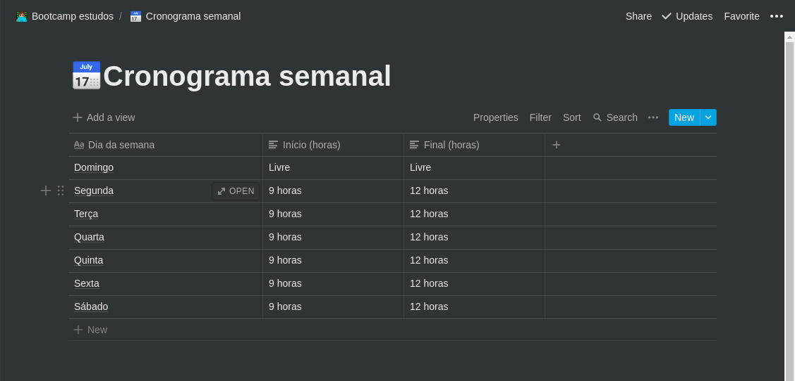
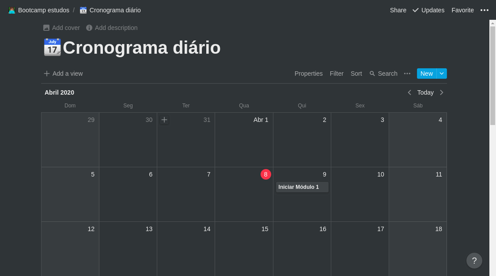
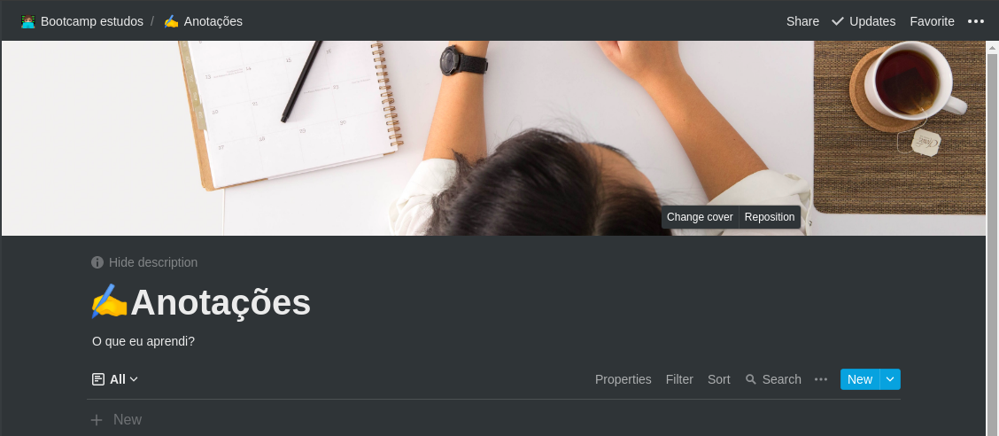

# Challenge 01
The first challenge was to create a schedule. In the videos I watched at the bootcamp, they give us tips on how to create. So I created a Weekly Agenda, Daily Agenda and a page for Notes.

I made this on [Notion](https://www.notion.so/) 

### Weekly Agenda

In the Weekly Agenda, I put the days of the week and the hours that I will study. I put 9am to 12pm, for 7 days.

### Daily Agenda

In the Daily Agenda, I put what I will do in thats days, like study the level 01 or study React in that day. I can put too if I already started or if is pendent.

### Notes

In Notes I can put what I learn on each level, this way I will learn what I'm whatching in a easier way, Since talking about a subject facilitates your learning.
###### ps.: this is talked about in the bootcamp too. :)
